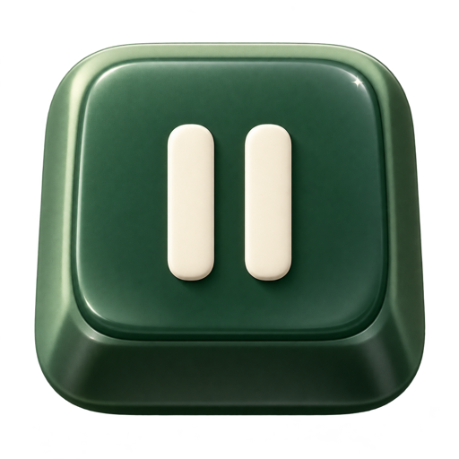
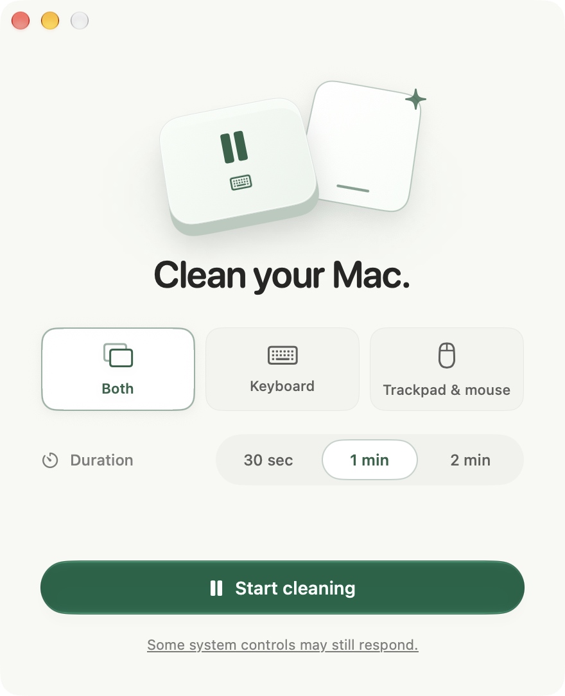
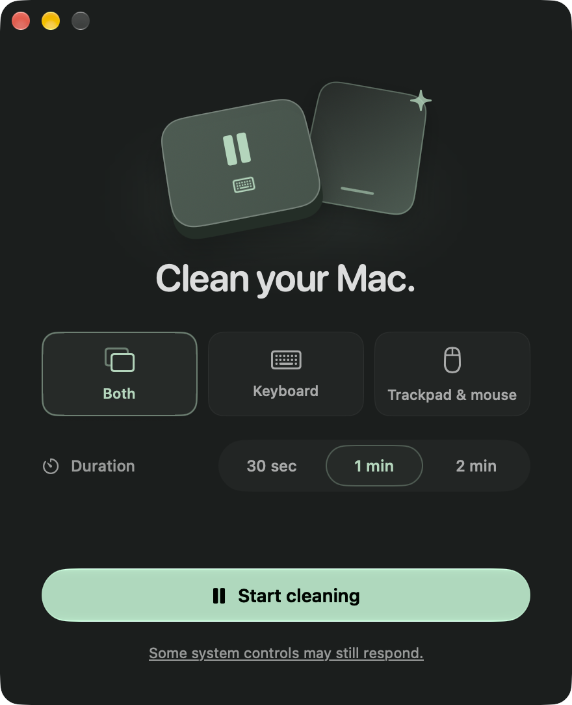

<p align="center">
  
</p>

<h1 align="center">Keydoze</h1>
<p align="center">A quiet moment for your Mac.</p>
<p align="center">Pause everyday keyboard, trackpad, and mouse input while you clean.</p>

<p align="center">
  
  
</p>

A small native macOS utility built with SwiftUI and AppKit. Choose what to pause, choose a short timer, and start cleaning. Input returns automatically when the timer ends.

- **Three scopes:** both, keyboard, or trackpad and mouse, including external devices.
- **Short sessions:** 30 seconds, 1 minute, or 2 minutes, with time to lift your hands before input pauses.
- **Always-visible recovery:** hold both Shift keys for two seconds, or press Escape in pointing-only mode.
- **Made for Mac:** a continuous native window, light and dark appearances, subtle SwiftUI transitions, and accessible motion and transparency fallbacks.
- **Completely offline:** no accounts, analytics, advertising, network requests, or saved input.

## Get started

Keydoze is currently a [source preview](https://github.com/dlev02/Keydoze/releases/tag/v0.1.0-preview.1). The distribution build is Developer ID signed and has been submitted to Apple for notarization; approval and the downloadable release are pending. Build locally with **macOS 26+** and an Xcode toolchain supporting **Swift 6.2+**:

```sh
git clone https://github.com/dlev02/Keydoze.git
cd Keydoze
./script/build_and_run.sh
```

Allow Accessibility when requested, select a scope and duration, then choose **Start cleaning**. Release keys and buttons and lift your hands during the three-second preparation period. Input returns after the timer and a brief release check. Keyboard-only mode also offers **Finish now**. After a session, choose **Clean again** to return to setup; use the standard window close button or ⌘Q to quit.

Keydoze pauses events delivered to the public macOS input stream. Some system gestures and hardware keys can still respond; Touch ID, power, and security controls are outside its coverage. The cleaning workflow has been tested successfully on the developer’s laptop hardware; broader device and edge-case coverage remains open. See the [tested behavior and remaining limits](docs/VALIDATION.md).

## Development

```sh
swift test --disable-sandbox          # core and in-memory event-adapter tests
./script/build_and_run.sh --simulate # safe UI preview; no input blocking
./script/build_and_run.sh --release  # local optimized app; no publication
```

There are no package dependencies. CI passes on macOS 26 with Xcode 26.2, and the native app has been checked on Apple silicon with macOS 27 beta. Interactive macOS 26 and Intel validation are still open. See [development and previews](docs/DEVELOPMENT.md), [release preparation](docs/RELEASING.md), and [contributing](CONTRIBUTING.md).

## Privacy and security

The app processes input only for a user-started session and removes its event tap when the session ends. It saves only your scope and duration preferences. Read the [privacy policy](PRIVACY.md) or [report a security issue](SECURITY.md).

## License and credit

Created by **Drew Levinson**. Open source under the [Apache License 2.0](LICENSE).

Forks and modifications are welcome. When distributing a derivative, retain the applicable attribution and [NOTICE](NOTICE), include the license, and identify modified files as required by the license. See [contributing](CONTRIBUTING.md#license-and-attribution) for details.
